# Руководство пользователя — возможности веб-сервиса

Функциональное описание веб-интерфейса: что показывает и что позволяет сделать каждый раздел сайта. Дополняет Сопроводительную документацию (там — архитектура, методы, ограничения и API) — этот документ смотрит на сервис со стороны пользователя, а не разработчика. Краткая версия этой же информации есть прямо в интерфейсе сервиса — раздел «Справка» после входа в систему.

## Роли и меню

В боковом меню — восемь разделов, доступных всем ролям (**Диспетчер**, **Аналитик**, **Администратор**): Обзор, Риски, Журнал, Заявки, Модели, Объекты и каналы, Аналитика, Справка. Ещё два раздела — Журнал аудита и Пользователи — видны и доступны только роли **Администратор**; для остальных ролей эти маршруты в интерфейсе вообще не существуют (это не скрытая кнопка, а полное отсутствие доступа на уровне маршрутизации).

Роль и логин текущего пользователя видны внизу бокового меню.

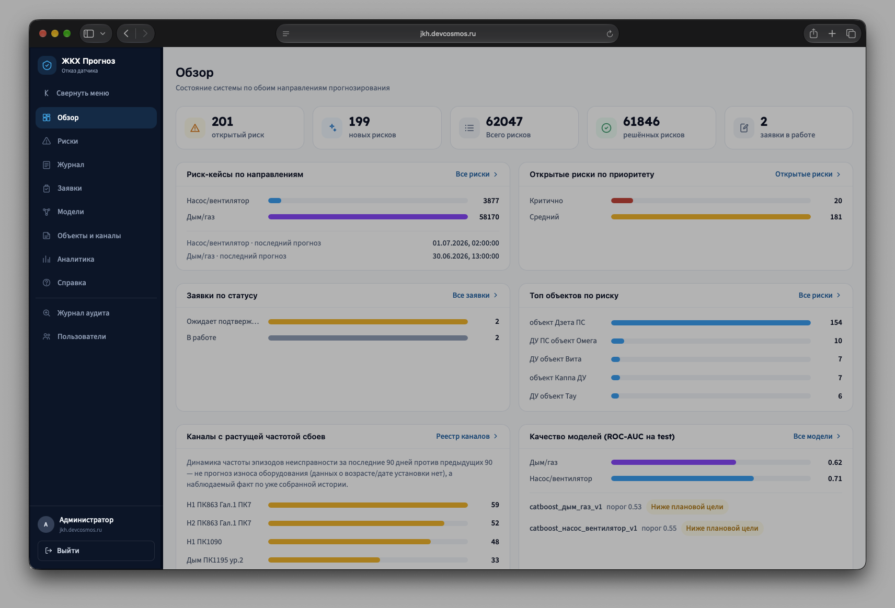

## 1. Вход

Экран входа — логин и пароль. В демонстрационной версии поля предзаполнены демо-учётной записью администратора (явно как хакатон-демо, не реальные данные) — для входа достаточно нажать «Войти». При неверных данных — сообщение «Неверный логин или пароль».

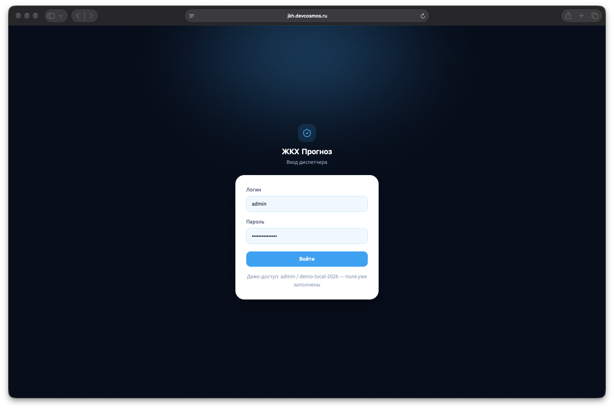

## 2. Обзор (Дашборд)

**Назначение:** сводная картина состояния системы по обоим направлениям прогнозирования (насос/вентилятор и дым/газ) на одном экране — отправная точка перед погружением в детали.

**Что на экране:**

- Пять плашек-счётчиков: открытые риски, новые риски, всего рисков, решённые риски, заявки в работе — каждая кликабельна и ведёт в соответствующий раздел с уже применённым фильтром.
- Риск-кейсы по направлениям (с датой последнего прогноза).
- Открытые риски по приоритету (Критично / Средний).
- Заявки по статусу.
- Топ объектов по риску — со ссылками в раздел «Риски».
- Каналы с растущей частотой сбоев за последние 90 дней (в сравнении с предыдущими 90) — со ссылками в «Объекты и каналы». В интерфейсе прямо указано: это наблюдаемый факт по истории, а не прогноз износа оборудования (данных о возрасте/дате установки датчика нет).
- Качество моделей (ROC-AUC на тестовой выборке) с пометкой «Цель достигнута» / «Ниже плановой цели» и текущим рабочим порогом каждой модели.

**Действия:** переходы по плашкам и ссылкам в другие разделы. Фильтров и форм на самой странице нет — это витрина, а не рабочий экран.
 
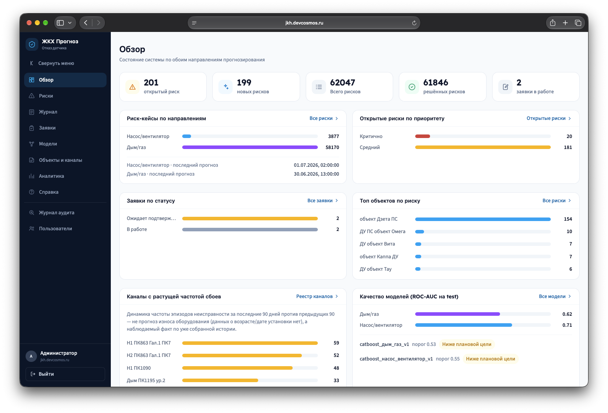

## 3. Риски

**Назначение:** главный рабочий экран диспетчера — список всех риск-кейсов (сработавших прогнозов) и принятие решений по каждому.

**Что на экране:**

- Четыре счётчика: открытые / критичные / аномалии / новые.
- Переключатель вида: «Список» или «Схема объектов» (иерархическая схема с цветовой индикацией риска — используется вместо GPS-карты, так как координат объектов нет).
- Таблица риск-кейсов: ID, ID канала, Направление, % отказа (цветной индикатор), Статус, Приоритет, Открыт.
- При клике по строке справа открывается карточка риска (см. ниже) для принятия решения.

**Фильтры и сортировка:** по статусу, по направлению (оба / насос-вентилятор / дым-газ), по приоритету, переключатель «Только аномалии», поиск по ID риска или ID канала. Клик по заголовку любой колонки — сортировка по возрастанию/убыванию.

**Действия:** «Экспорт CSV» (выгружает текущую отфильтрованную страницу), «Обновить», переход по ссылкам канала/объекта в «Объекты и каналы».

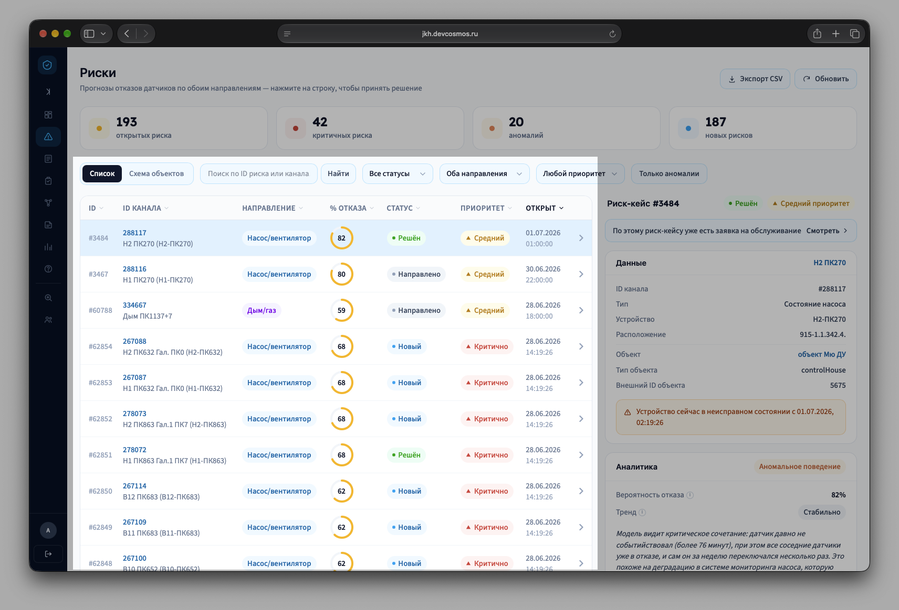

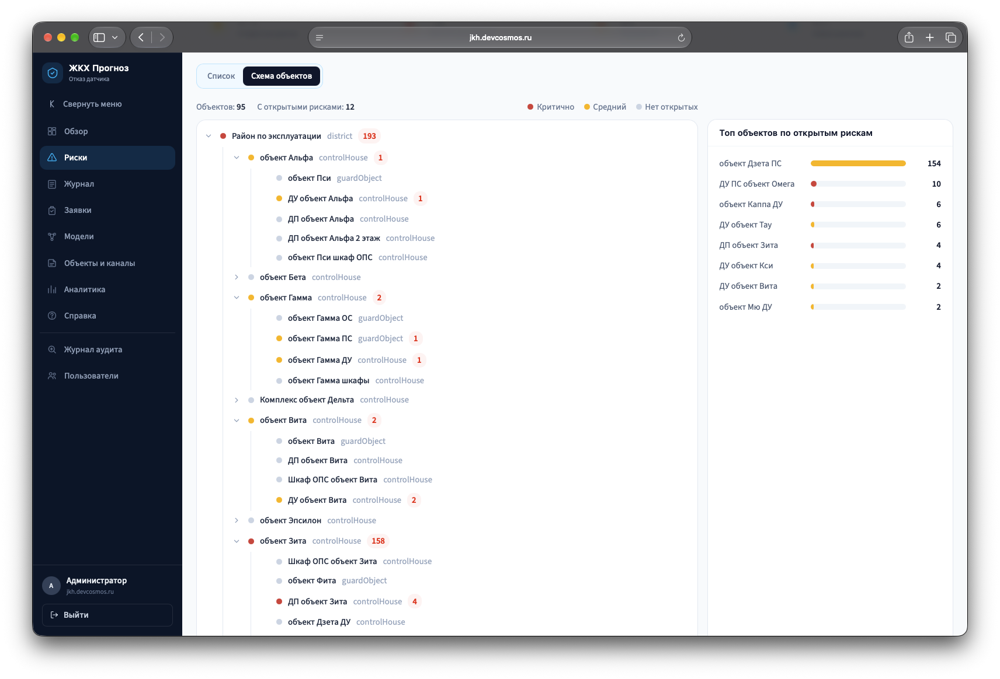

### 3.1. Карточка риск-кейса (открывается при клике на строку)

**Назначение:** почему сработал прогноз и что с этим делать диспетчеру.

**Что на экране:**

- Статус и приоритет кейса.
- Данные канала: тип, устройство, расположение, объект — со ссылками на «Объекты и каналы»; предупреждение, если устройство сейчас в неисправном состоянии.
- Аналитика: вероятность отказа (с пояснением), бейдж тренда, бейдж аномалии, текстовое резюме от GigaChat-2, SHAP-объяснение прогноза (какие признаки повлияли и насколько).
- История эпизодов неисправности по каналу.
- Если по кейсу уже есть заявка на обслуживание — форма решения скрывается, вместо неё ссылка на заявку.

**Действия диспетчера:** выбор готовой причины из справочника (6 формулировок) с возможностью дополнить свободным текстом, и одна из трёх кнопок решения — **«Направить на проверку»** (создаёт заявку на обслуживание), **«Наблюдать»**, **«Отклонить»**. После сохранения — явное подтверждение принятого решения.

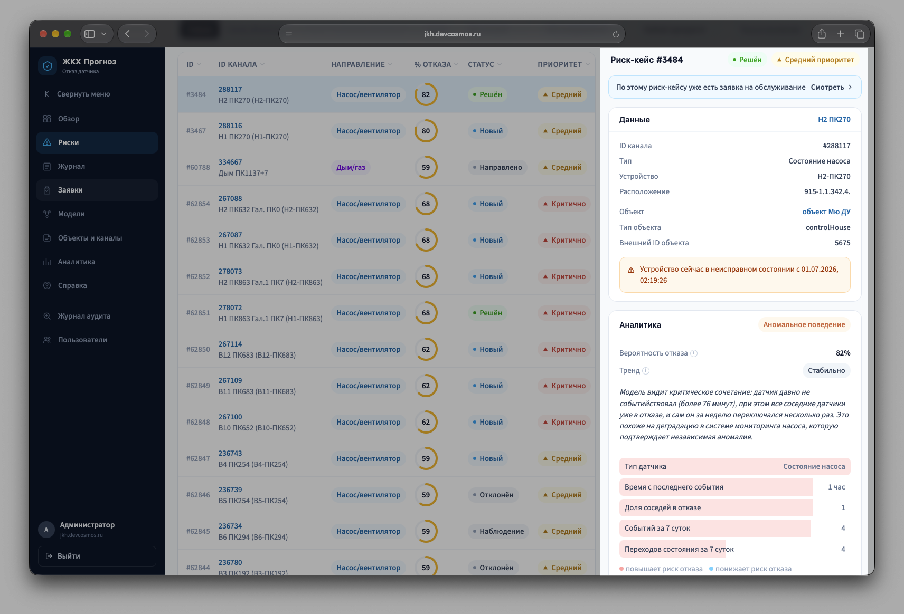

## 4. Журнал (прогнозов)

**Назначение:** история сохранённых прогнозов — последний расчёт по каждому риск-кейсу с объяснением модели, в табличном виде.

**Что на экране:** таблица (Время расчёта, Канал, Направление, Вероятность, Качество данных); строки старше 24 часов от самого свежего прогноза в выборке подсвечены как устаревшие. При клике справа — детальная карточка прогноза (окно прогноза, качество данных, вероятность, резюме от LLM, SHAP-объяснение).

**Фильтры и сортировка:** по направлению, поиск по ID риска/канала; сортировка по времени расчёта и вероятности.

**Действия:** «Обновить», переход «Открыть риск-кейс» в раздел «Риски».

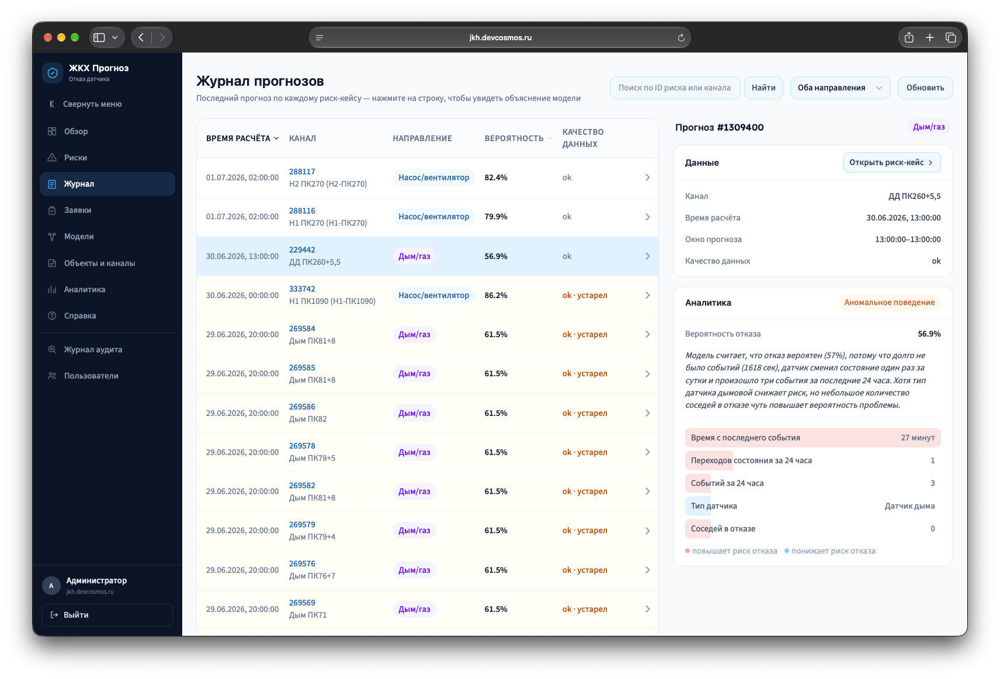

## 5. Заявки на обслуживание

**Назначение:** сопровождение заявок, которые диспетчер создал решением «Направить на проверку», до завершения работ.

**Что на экране:** таблица заявок (ID, Объект/канал, Вид работы, Приоритет, Статус, Создана). При клике справа — детальная карточка: ссылка на связанный риск-кейс, обоснование (резюме от LLM, решение диспетчера с причиной), степпер стадий выполнения (черновик → согласована → в работе → завершена, либо отклонена/отменена), полная история переходов статуса с указанием, кто и почему изменил статус.

**Фильтры и сортировка:** по статусу; сортировка по приоритету, статусу, дате создания.

**Действия:** «Экспорт CSV», «Обновить», кнопки перехода статуса (набор кнопок зависит от текущей стадии — интерфейс не даёт выбрать недопустимый переход). Для завершённых/отменённых заявок кнопок нет — явно указано, что дальнейших переходов не предусмотрено.

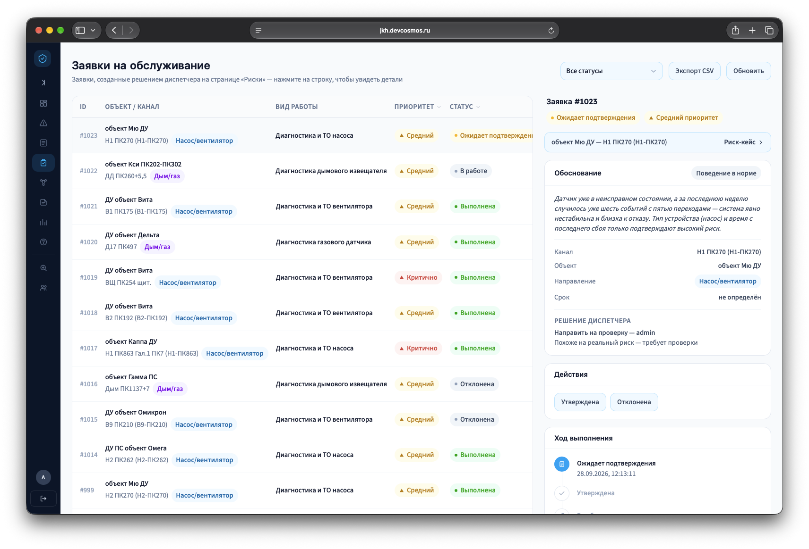

## 6. Модели

**Назначение:** прозрачность — какие модели сейчас принимают решения в системе и насколько они хороши, без скрытых деталей.

**Что на экране:** по карточке на каждую активную модель CatBoost (одна на направление) — рабочий порог, ROC-AUC и PR-AUC на тестовой выборке, плановая цель по Precision/Recall с честным статусом «достигнута» / «ниже плановой цели (обоснованно)», топ-5 важных признаков, график калибровки вероятности. Ниже — два информационных блока про вспомогательные модели: независимая проверка аномального поведения (IsolationForest) и резюме прогноза на естественном языке (GigaChat-2, с явной оговоркой, что модели запрещено что-либо придумывать сверх переданных данных).

Администратору дополнительно видна история прежних версий моделей (заменённых при дообучении).

**Действия:** страница только для чтения, форм и кнопок нет.

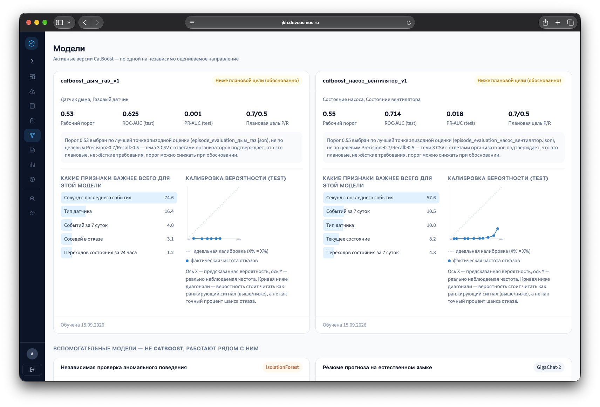

## 7. Объекты и каналы

**Назначение:** справочник оборудования — какие каналы датчиков к какому объекту относятся.

**Что на экране:** таблица каналов (ID, Название, Устройство, Тип датчика, Объект, Расположение, Тренд деградации), со ссылками на связанные риски.

**Фильтры:** поиск по названию канала или расположению, выбор типа датчика, выбор объекта.

**Действия:** переходы в «Риски» с фильтром по каналу или объекту.

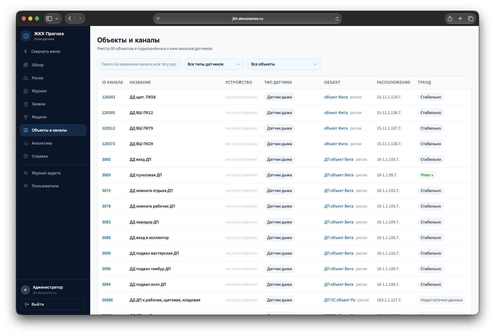

## 8. Аналитика

**Назначение:** исторический отчёт для руководства — по эпизодам неисправности, сезонности и заявкам на обслуживание, а не оперативная работа с отдельными рисками.

**Что на экране:** детальная статистика по типам инцидентов (эпизоды, риск-кейсы, открыто сейчас, средняя вероятность); диаграмма сезонности (среднее число эпизодов по месяцам); отчёт по заявкам — по виду работ, по статусу, среднее время до утверждения, динамика по месяцам. В интерфейсе есть честная оговорка: сезонность — статистика по фактическим данным, а не откалиброванная интенсивность отказов.

**Действия:** «Скачать XLSX» и «Скачать PDF» — экспорт полного отчёта.

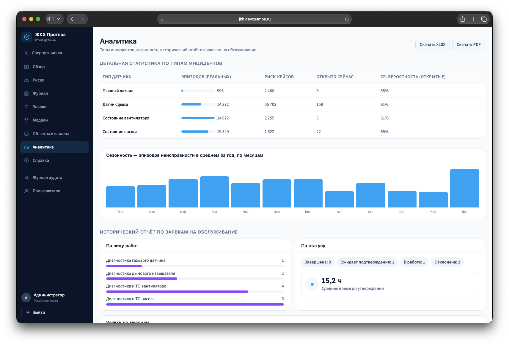

## 9. Журнал аудита (только администратор)

**Назначение:** полная прослеживаемость изменений в системе — кто и когда что изменил.

**Что на экране:** таблица (Время, Кто, Тип записи, ID, Изменение — «было / стало», Причина).

**Фильтры:** по типу записи (риск-кейс, заявка, доступ к объекту, пользователь).

**Действия:** страница только для чтения.

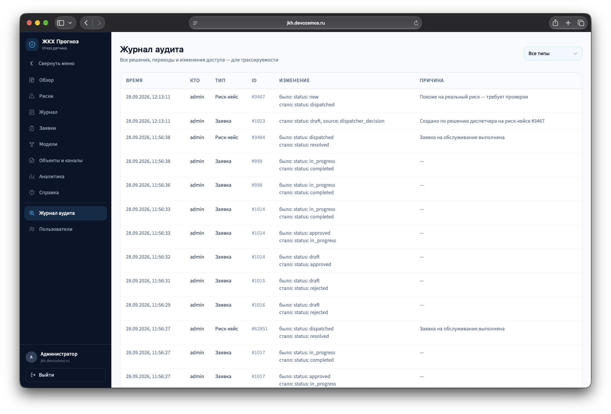

## 10. Пользователи и доступ (только администратор)

**Назначение:** управление учётными записями и тем, к каким объектам у кого есть доступ.

**Что на экране:** форма создания пользователя (логин, пароль, роль — пароль не короче 8 символов); список пользователей с ролью и статусом (активен/отключён); для не-администраторов — список выданных объектов с возможностью добавить или отозвать доступ к конкретному объекту. Если у пользователя нет ни одного назначенного объекта, рядом явно написано «без ограничений — доступ ко всему» — это осознанное правило MVP, а не ошибка интерфейса (подробнее — `Сопроводительная_документация.md`, §2.5).

**Действия:** создание пользователя, выдача/отзыв доступа к объекту.

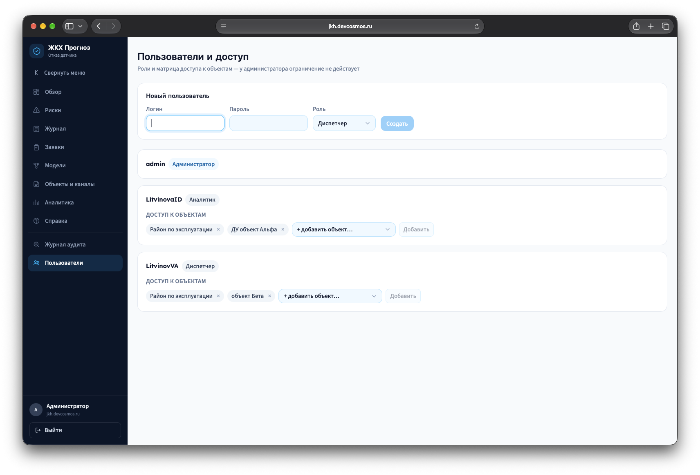

## 11. Справка

Встроенная в интерфейс справочная страница — доступна из меню всем ролям. Содержит: описание разделов панели, пошаговую инструкцию «Как принять решение по риску», инструкцию «Как отследить заявку», глоссарий терминов (включая пояснение «флаппинга»), краткое описание API и частые вопросы. Разделы, доступные только администратору, в самой справке тоже помечены как admin-only.

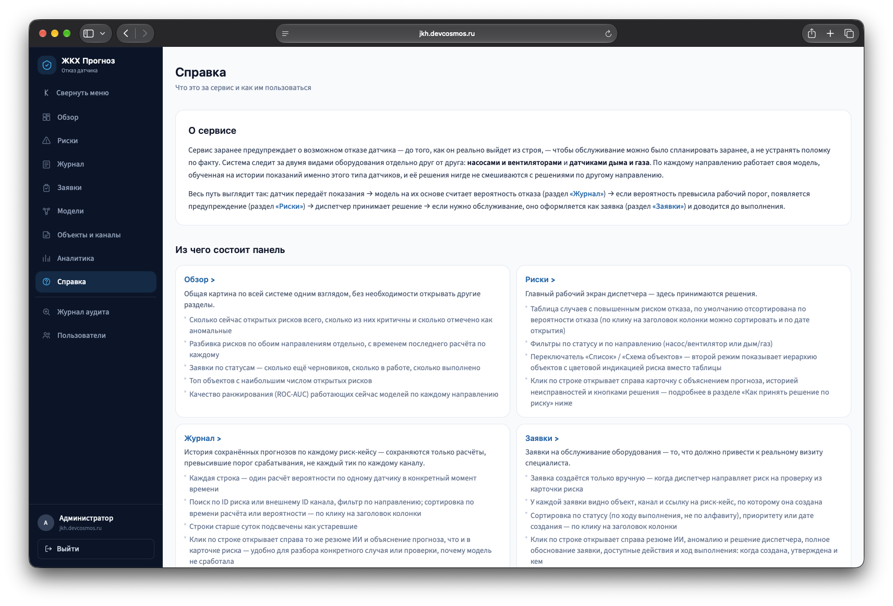
